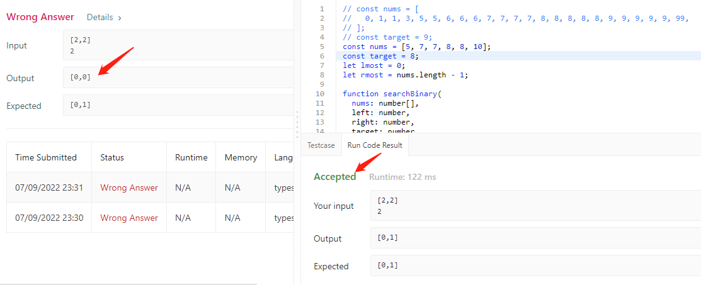

# find-first-and-last-position-of-element-in-sorted-array

## Link

https://leetcode.com/problems/find-first-and-last-position-of-element-in-sorted-array/

## Takeaway

- recursion with lmost and rmost recording for find the boundary. reuse binarySearch function to find out the leftmost and rightmost matching one.

- Looks like leetcode has bugs for my submission, see 
